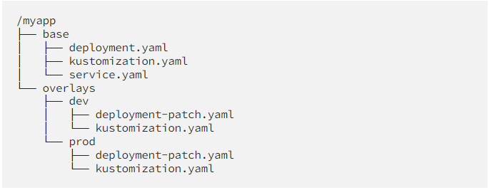
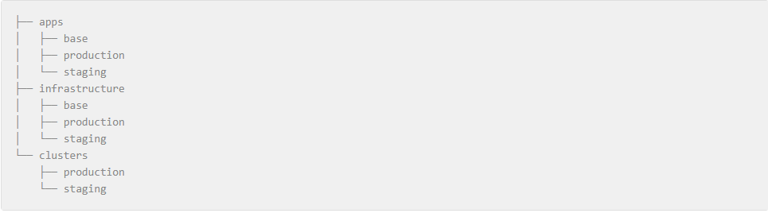

# Flux repository structure

To provide clarity, it's important to distinguish between two distinct types of kustomize in use. One is the Kubernetes concept of kustomize, and the other is the Flux concept of kustomize. Both are employed to ensure accurate synchronization with the Kubernetes cluster.

## Kubernetes Kustomize

Kubernetes Kustomize enables the modification or transformation of manifests prior to their application to the cluster. The repository includes a base configuration stored as a manifest, and an overlay manifest is generated to specify environment or cluster-specific configurations. A standard repository structure is illustrated in the example below.

[This post][kustomizeTutorial] gives a crash course on Kustomize

## Flux Kustomize 

The Flux kustomize specifies a repository path monitored by Flux for deploying resources to the cluster, ensuring ongoing synchronization between the repository and the cluster. Essentially, it functions as a wrapper for Kubernetes Kustomize.

More information can be found in the [flux documentation][fluxKustomizationDocs]

## Repository Structure Proposal

Given that the repository structures are very similar in nature we are proposing modeling our repository structure in the same fashion. This allows us to standardize with the recommended structure from the maintainers of flux and kustomize. We are going to more closely follow the flux recommended structure however because the monolithic nature of our repository the level under the parent folders: `apps`, `infrastructure`, and `clusters`, will be the name of the app or service.

Additionally a proposal id made for a `namespace` folder to be located under the infrastructure folder. Given that we use Active Directory for RBAC control it makes sense to have a centralized definition of namespaces to ensure they are configured correctly.

## Parent Folder Definitions

### Apps

This will include a folder for each application's manifests. Within each app folder, there will be at least two additional folders: base and `<cluster name>`, with the `<cluster name>` folder recurring for each of the clusters where the application is intended to be deployed.

### Clusters

This will include a folder for each cluster that an application can be deployed to. Within each of these folders, a Flux kustomization will be generated for every application or service slated for deployment. This kustomization will be pointed to the corresponding cluster folder within the structure of the apps folder.

### Infrastructure

This directory closely resembles the `apps` folder, focusing on the deployment of applications and services integral to the Kubernetes platform offering.

## Configuration differences

1. Flux will cease monitoring a namespace folder. In an effort to facilitate a smoother transition from Flux v1 to v2, we tailored the Flux setup to enable teams to place their manifests within a namespace folder. While this approach had numerous advantages initially, over time, the benefits of adhering to a recommended structure have become more compelling than maintaining the non-standard setup implemented earlier.

1. Every application or service will possess its own kustomization for deployment into a cluster. While this introduces additional boilerplate, it serves to confine the potential impact of a misconfiguration in a manifest, as only the specific application will be prevented from syncing to the cluster.

1. As namespaces are a shared resource and we are moving away from namespace-specific folders, we will introduce a namespace folder to explicitly define namespaces. Although this may seem unconventional, it is implemented to exert control over RBAC, particularly since we rely on Azure Entra for access control.

## Consequences of Repository Restructuring

1. The existing task group pipeline, which is still widely employed, will not undergo updates to accommodate the new configuration. This approach to Kubernetes deployment deviates from the GitOps model by directly deploying resources to the cluster, bypassing the standard process of updating the configuration and relying on the tools to ensure the cluster attains its intended state.

1. The boilerplate structure that is needed to be able to configure each cluster individually introduces a higher level of cognitive load.

[fluxKustomizationDocs]: https://fluxcd.io/flux/components/kustomize/kustomizations/
[kustomizeTutorial]: https://devopscube.com/kustomize-tutorial/

## Application Configuration Definition

We have identified 3 different ways to organizing the manifests

### Explicit Definition

Each service is explicitly defined in the folder structure for each environment and there are no shared files between RC and PROD.

- Pros
  - Full separation between environments
- Cons
  - Full separation between environments

### Kustomization Definition

This introduces an additional folder level to represent the environment. Both RC and Prod share a base configuration file. All configuration is defined in each of the `kustomization.yaml` files. Any configuration that would be similar between the 2 environments would eventually want to be defined within the base `release.yaml` as to ensure the kustomization files does not get unruly.

- Pros
  - Less boilerplate
  - All configuration in one place
- Cons
  - Additional step to migrate configuration to the base configuration

### Prod Kustomization Wrapper

This is very similar to the previous solution however instead of promoting changes from the RC kustomization to the Production kustomization, all changes get promoted to the base configuration and the PROD kustomization just deploys the base config.

- Pros
  - Simplified environment promotion
- Cons
  - May not be obvious where configuration needs to be defined for production workloads
